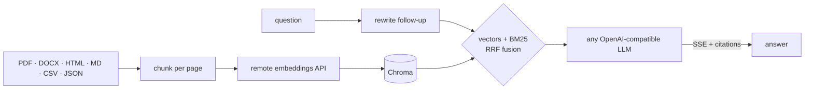

<div align="center">

<picture>
  <source media="(prefers-color-scheme: dark)" srcset="docs/logo-dark.png">
  
</picture>

### the api that digs the nugget out of your docs

Multilingual hybrid-search RAG: BM25 + vectors, streamed cited answers, light enough to run on a free instance.


[← Frontend](https://github.com/colombefioren/NUGGET--FRONTEND) · **Backend**

</div>

## ✦ How it digs



- **Hybrid retrieval**: dense vectors for meaning, BM25 (accent folding, CJK bigrams) for exact terms, merged with reciprocal rank fusion
- **Cross-lingual**: ask in Japanese about a French PDF and get the answer in Japanese
- **Grounded**: every claim carries an `[n]` citation. Follow-ups are rewritten into standalone search queries first
- **Light**: no ML model runs in-process — embeddings are a remote API call, same as the chat model. Idles around 170MB, comfortably inside a 512MB free instance (measured, not estimated)
- **Deduplicated**: re-uploading identical content is a no-op, keyed by a content hash

## ✦ Run it

```bash
cp .env.example .env     # set the chat AND embeddings provider — see below
uv sync
uv run uvicorn app.main:app --reload --port 8000
```

Or with Docker: `docker build -t nugget-backend . && docker run -p 8000:7860 --env-file .env nugget-backend`.

| Env | |
| --- | --- |
| `NUGGET_API_BASE` · `NUGGET_CHAT_MODEL` · `NUGGET_API_KEY` | **required**: any OpenAI-compatible chat endpoint. Ingest/library endpoints work without a key — only answer generation needs it |
| `NUGGET_EMBEDDING_API_BASE` · `NUGGET_EMBEDDING_MODEL` · `NUGGET_EMBEDDING_API_KEY` | **required**: a *separate* OpenAI-compatible embeddings endpoint (most chat providers don't offer one). Free options: NVIDIA NIM (`nvidia/nemotron-3-embed-1b`), Mistral AI (`mistral-embed`), Jina AI, Voyage AI |
| `NUGGET_TOP_K` · `NUGGET_CHUNK_SIZE` · `NUGGET_MAX_UPLOAD_MB` | `6` · `1000` · `25` |

## ✦ Endpoints

| | |
| --- | --- |
| `POST /query/stream` | SSE: `sources` → `token`… → `done` |
| `POST /query` | `{ question, history?, doc_ids?, locale? }` → answer + sources + timings |
| `POST /ingest/file` · `/ingest/text` | index a file or pasted text |
| `GET /documents` · `DELETE /documents/{id}` | library |
| `GET /documents/{id}/chunks` · `GET /health` | passages · status |

```bash
uv run pytest && uv run ruff check .   # offline: fake embedder + fake LLM
```

<div align="center"><sub>made with 🟡 by <a href="https://github.com/colombefioren">colombefioren</a></sub></div>
