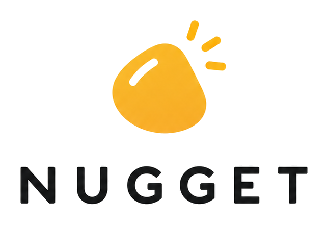
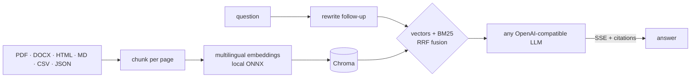

<div align="center">

<picture>
  <source media="(prefers-color-scheme: dark)" srcset="docs/logo-dark.png">
  
</picture>

### the api that digs the nugget out of your docs

Multilingual hybrid-search RAG: local embeddings, BM25 + vectors, streamed cited answers.


[← Frontend](https://github.com/colombefioren/NUGGET--FRONTEND) · **Backend**

</div>

## ✦ How it digs



- **Hybrid retrieval**: dense vectors for meaning, BM25 (accent folding, CJK bigrams) for exact terms, merged with reciprocal rank fusion
- **Cross-lingual**: ask in Japanese about a French PDF and get the answer in Japanese
- **Grounded**: every claim carries an `[n]` citation. Follow-ups are rewritten into standalone search queries first
- **Private indexing**: embeddings are computed on your machine, and re-uploaded files are deduplicated by content hash

## ✦ Run it

```bash
cp .env.example .env     # set NUGGET_API_BASE, NUGGET_CHAT_MODEL, NUGGET_API_KEY
uv sync
uv run uvicorn app.main:app --reload --port 8000
```

| Env | |
| --- | --- |
| `NUGGET_API_BASE` · `NUGGET_CHAT_MODEL` | **required**, any OpenAI-compatible endpoint + model |
| `NUGGET_API_KEY` | needed to generate answers (retrieval works without it) |
| `NUGGET_EMBEDDING_MODEL` | default `paraphrase-multilingual-MiniLM-L12-v2` |
| `NUGGET_TOP_K` · `NUGGET_CHUNK_SIZE` · `NUGGET_MAX_UPLOAD_MB` | `6` · `1000` · `25` |

## ✦ Endpoints

| | |
| --- | --- |
| `POST /query/stream` | SSE: `sources` → `token`… → `done` |
| `POST /query` | `{ question, history?, doc_ids?, locale? }` → answer + sources + timings |
| `POST /ingest/file` · `/ingest/text` | index a file or pasted text |
| `GET /documents` · `DELETE /documents/{id}` | library |
| `GET /documents/{id}/chunks` · `GET /health` | passages · status |

```bash
uv run pytest && uv run ruff check .   # offline: fake embedder + fake LLM
```

<div align="center"><sub>made with 🟡 by <a href="https://github.com/colombefioren">colombefioren</a></sub></div>
